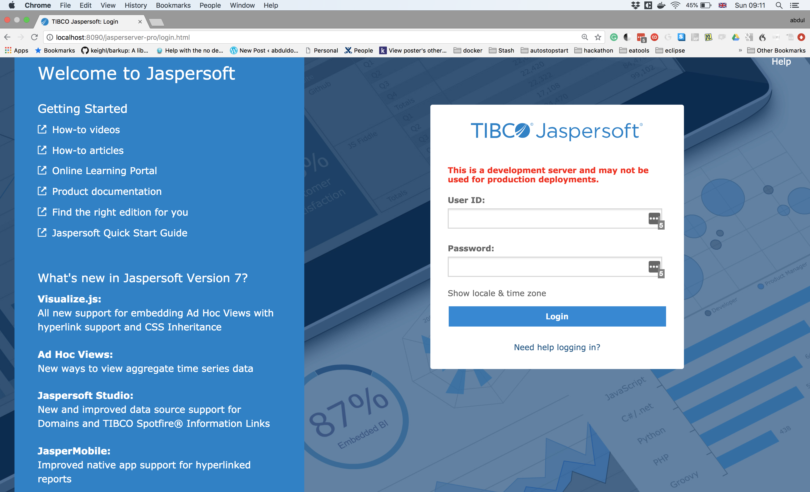

    diagram 1: Jasper Report Server landing page.

|

<a href="https://asciinema.org/a/nUTiPLQ4lgsM83seIX6x7Q5Ax" target="_blank"></a>

    diagram 2: the build and deploy activities


### What is this?

    This repo creates a jasper report server docker image


###  How to use?

    you have two options depending on your preference.

    - you can run the utilities script to automate the build and deployment.
    WARNING : the script deletes a folder named ${HOME}/tmp-js-docker-dna. it also removes all containers (running or not) and all images.

    - alternatively, you can do it manually by as detailed on steps 1 to 5 below.

    1. clone

    2. add to cloned repo cofig, software distros and license. you shoudl end up with structure like this  
```
|--- README.md - this file
|--- js
     |----- Dockerfile
     |----- default_master.properties
     |----- jasperserver.license
     | ---- -TIB_js-jrs_7.1.00_bin.zip
     tomcat
          |----- Dockerfile
          |----- default_master.properties
          |----- apache-tomcat-8.5.35.tar.qz
```

    3. create  images and run containers


```

    $ docker stop $(docker ps -a -q)
    $ docker rm $(docker ps -a -q)
    $ docker rmi -f $(docker images -a -q)

    $ cd .../js-docker-dna/tomcat
    $ docker build -t tomcat   .

    $ docker run -it -p 8090:8080 tomcat
    $ docker stop $(docker ps -a -q)

    $ cd .. /js-docker-dna/js
    $ docker build -t js .

    $ psql -h 127.0.0.1 -p 5433  -U postgres
    $ postgres#/ drop DATABASE jasperserver;
    £ postgres#/ \q

    $ docker run -it --rm -p 8090:8080  js

  ```

    4. go  to  http://localhost:8090/jasperserver-pro/login.html .
